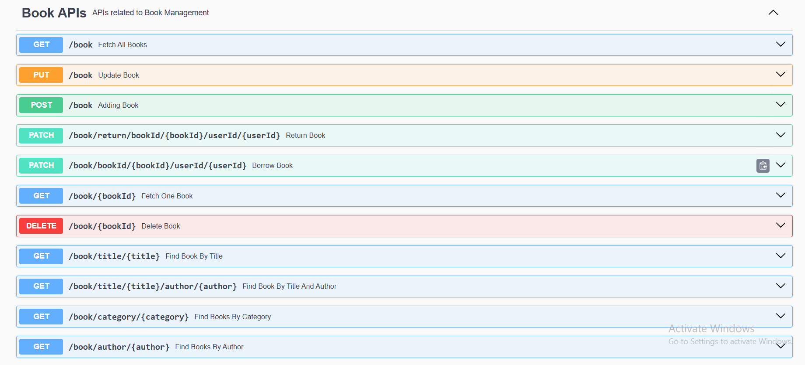
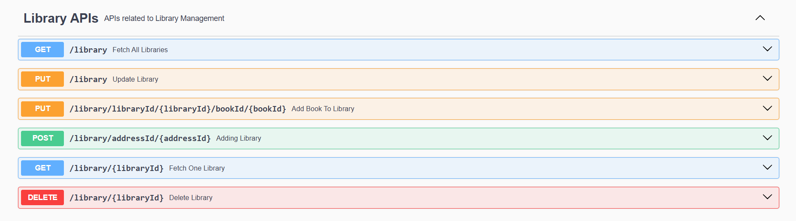
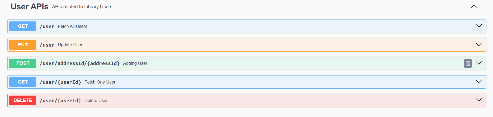
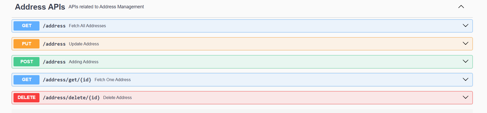

# 📚 Library Management System

A RESTful backend application built with **Spring Boot** that manages libraries, books, users and addresses, including borrowing and returning books with automatic tracking of available copies. APIs are documented and testable through **Swagger UI**.

## ✨ Features

- **Library management**: create, view, update and delete libraries; link a library to its address; add books to a library
- **Book management**: full CRUD, plus search by title, author, category, or title and author together
- **User management**: register users with their address; update, view and delete users
- **Address management**: full CRUD for addresses, with a check to prevent one address being assigned twice
- **Borrow and return books**: borrowing reduces available copies and records the borrow time; returning restores the copy, records the return time and verifies the user actually borrowed that book
- **Input validation**: validated fields such as a non-blank title, author length, valid email and a 10-digit phone number
- **Global exception handling**: clean, meaningful error responses with proper HTTP status codes (404 Not Found, 409 Conflict)
- **API documentation**: interactive Swagger / OpenAPI UI

## 📸 Screenshots

### Book APIs


### Library APIs


### User APIs


### Address APIs


## 🛠️ Tech Stack

| Area | Technology |
|---|---|
| Language | Java 21 |
| Framework | Spring Boot 4.1.1 (Spring Web MVC) |
| Persistence | Spring Data JPA, Hibernate |
| Database | PostgreSQL |
| Validation | Jakarta Bean Validation |
| Mapping | ModelMapper (Entity ↔ DTO) |
| API Docs | springdoc-openapi (Swagger UI) |
| Utilities | Lombok |
| Build Tool | Maven |
| IDE | Spring Tool Suite (STS) |

## 🏗️ Architecture

The project follows a layered architecture:

```
Controller  →  Service  →  Repository  →  Database
     ↕            ↕
    DTO        Entity
```

```
src/main/java/com/lms
├── controller    # REST endpoints
├── service       # Service interfaces
│   └── impl      # Business logic
├── repository    # Spring Data JPA repositories
├── entity        # JPA entities
├── dto           # Data transfer objects (with validation)
├── exception     # Custom exceptions and global handler
├── config        # Application configuration
└── util          # Mapper and error response helpers
```

## 🗄️ Data Model

- **Library**: one-to-one with Address, one-to-many with Book
- **User**: one-to-one with Address, many-to-many with Book (via the `user_book` join table)
- **Book**: many-to-many with User
- **Address**: standalone entity referenced by Library and User

## 🔗 API Endpoints

### Library: `/library`
| Method | Endpoint | Description |
|---|---|---|
| POST | `/library/addressId/{addressId}` | Create a library with an address |
| GET | `/library/{libraryId}` | Get a library by ID |
| GET | `/library` | Get all libraries |
| PUT | `/library` | Update a library |
| DELETE | `/library/{libraryId}` | Delete a library |
| PUT | `/library/libraryId/{libraryId}/bookId/{bookId}` | Add a book to a library |

### Book: `/book`
| Method | Endpoint | Description |
|---|---|---|
| POST | `/book` | Add a book |
| GET | `/book/{bookId}` | Get a book by ID |
| GET | `/book` | Get all books |
| PUT | `/book` | Update a book |
| DELETE | `/book/{bookId}` | Delete a book |
| GET | `/book/title/{title}` | Search by title |
| GET | `/book/author/{author}` | Search by author |
| GET | `/book/category/{category}` | Search by category |
| GET | `/book/title/{title}/author/{author}` | Search by title and author |
| PATCH | `/book/bookId/{bookId}/userId/{userId}` | Borrow a book |
| PATCH | `/book/return/bookId/{bookId}/userId/{userId}` | Return a book |

### User: `/user`
| Method | Endpoint | Description |
|---|---|---|
| POST | `/user/addressId/{addressId}` | Register a user with an address |
| GET | `/user/{userId}` | Get a user by ID |
| GET | `/user` | Get all users |
| PUT | `/user` | Update a user |
| DELETE | `/user/{userId}` | Delete a user |

### Address: `/address`
| Method | Endpoint | Description |
|---|---|---|
| POST | `/address` | Add an address |
| GET | `/address/get/{id}` | Get an address by ID |
| GET | `/address` | Get all addresses |
| PUT | `/address` | Update an address |
| DELETE | `/address/delete/{id}` | Delete an address |

## 🚀 Getting Started

### Prerequisites
- JDK 21
- Maven (or use the included `mvnw` wrapper)
- PostgreSQL

### 1. Clone the repository
```bash
git clone https://github.com/rithish25-source/library-management-system.git
cd library-management-system
```

### 2. Create the database
```sql
CREATE DATABASE library_management;
```

### 3. Configure the database
Edit `src/main/resources/application.properties` with your own PostgreSQL credentials:

```properties
spring.datasource.url=jdbc:postgresql://localhost:5432/library_management
spring.datasource.username=postgres
spring.datasource.password=your_password_here
```

Tables are created automatically on first run (`spring.jpa.hibernate.ddl-auto=update`).

### 4. Run the application
```bash
./mvnw spring-boot:run
```
On Windows: `mvnw.cmd spring-boot:run`. You can also run `LibraryManagementSystemApplication.java` directly from STS or any IDE.

### 5. Open Swagger UI
```
http://localhost:8080/swagger-ui/index.html
```

## 🧪 Sample Request

Add a book (`POST /book`):

```json
{
  "title": "Clean Code",
  "author": "Robert Martin",
  "category": "Programming",
  "numberOfCopy": 5
}
```

## ⚠️ Error Handling

| Scenario | HTTP Status |
|---|---|
| Book, user, library or address not found | 404 Not Found |
| Address already assigned to another record | 409 Conflict |
| No copies available / book not borrowed by user | 409 Conflict |

## 🔮 Future Improvements

- Spring Security with JWT authentication and role-based access (Admin / Member)
- Pagination and sorting for list endpoints
- Due dates and fine calculation for late returns
- Unit and integration tests
- Docker support
- Frontend UI (React / Angular)

## 👤 Author

**Rithish Kumar S**
GitHub: [@rithish25-source](https://github.com/rithish25-source)
LinkedIn: [rithish-kumar-s-161895281](https://www.linkedin.com/in/rithish-kumar-s-161895281)
